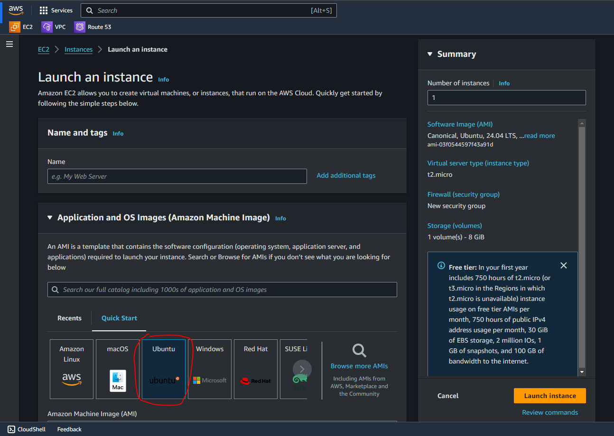
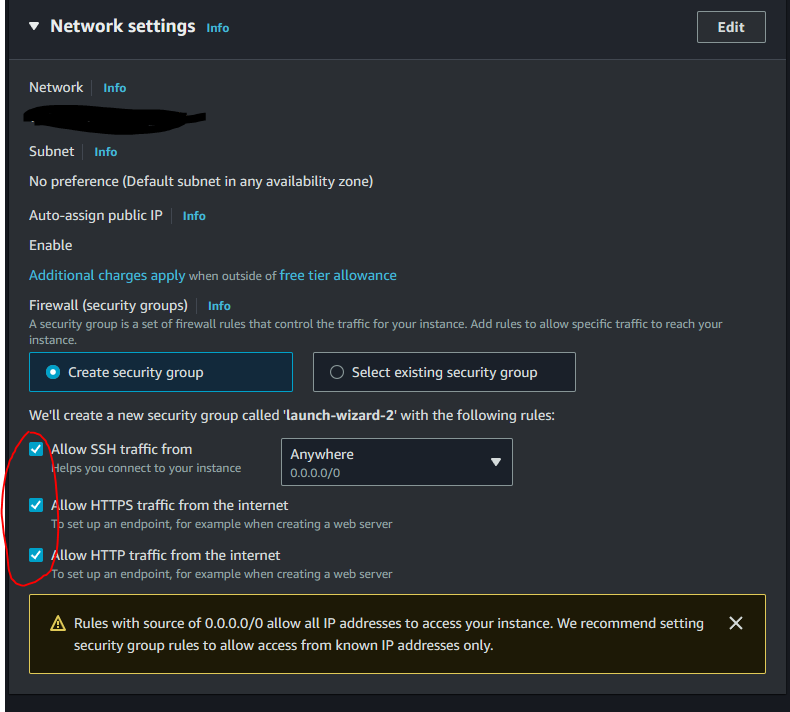
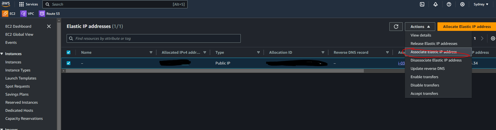

# Create AWS Ec2

- 進入 Ec2 畫面, click Launch an instance
- Add name, 選擇 Ubuntu
  
- Image and Instance type 選 Free tier
- Create new key pair and save key pair 用作 ssh
- In network, choose Allow HTTPS traffic from the internet and Allow HTTP traffic from the internet
  
- click Launch instance

# Create Elastic IPs

- 進入 Elastic IPs 畫面, click Allocate Elastic IP address
- click Allocate
- 選剛 created Elastic IPs, click Associate Elastic IP address
  
- click 你 created instance and click Allocate
- 你 created instance 就會有 Elastic IPs
