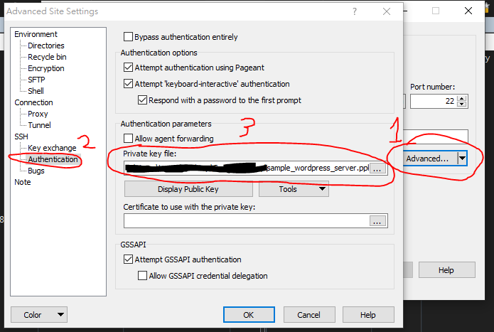
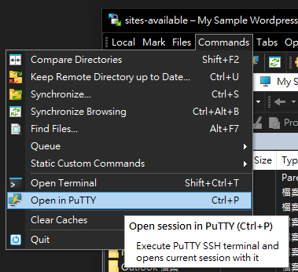

# Ssh instance

- Right click Instances, choose Connect
- click ssh client
- you can see your username and host
- Use WinSCP, click Edit, click Advanced, click Authentication, click Private key file, choose your instance key pair
  
  
- After connected, click commands, click open in putty
  
