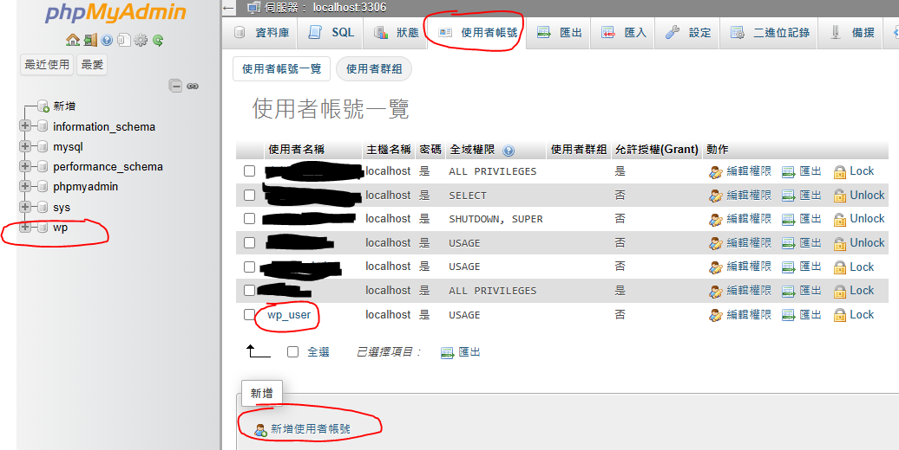
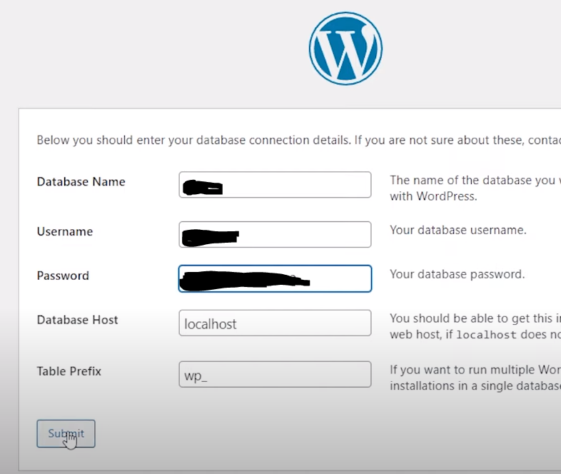

# Install wordpress

- Create database in phpmyadmin, choose utf8mb4_general_ci
- Create database User
  
- 編輯權限： 使用者帳號 wp_user, 只連接 wp database
- ssh instance
  ```
  cd /tmp
  wget https://wordpress.org/latest.tar.gz
  tar xzvf latest.tar.gz
  sudo mv wordpress/ /var/www/html/
  ```
- test http://your_server_ip/wordpress, and set config
  
- copy wp-config content
  ```
  cd /var/www/html/wordpress
  nano wp-config.php
  ```
- paste wp-config content in wp-config.php
- Adjust permissions
  ```
  sudo chown -R www-data:www-data /var/www/html/wordpress/wp-includes/
  sudo chown -R www-data:www-data /var/www/html/wordpress/wp-content/
  cd /var/www/html/wordpress
  nano wp-config.php
  ```
- add define('FS_METHOD', 'direct'); in wp-config.php

# Configure Apache for WordPress

- Set up a virtual host for your WordPress site.
  ```
  cd /etc/apache2/sites-available
  nano 000-default.conf
  ```
- DocumentRoot /var/www/html change to
  DocumentRoot /var/www/html/wordpress
- restart apache
  ```
  sudo apache2ctl configtest
  sudo systemctl restart apache2
  ```
- test http://your_server_ip, it will show your wordpress page

# 參考資料

- https://medium.com/@sutrapusharan/how-to-install-wordpress-on-aws-with-ubuntu-22-04-with-a-lamp-stack-220f7335089c
- https://ubuntu.com/server/docs/how-to-install-and-configure-phpmyadmin
- https://www.chirue.com/en/ubuntu-wordpress-web/
- https://www.youtube.com/watch?v=8Uofkq718n8&t=834s
