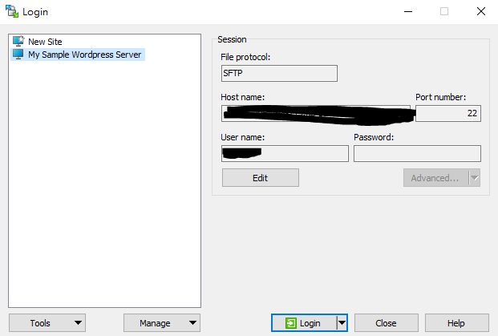

# Apache 同一個 IP 多站點設定(不同 port)

- 在 AWS Ec2 下 ssh Server

  - 
  - open putty
  - 使用 root 權限
    ```
    sudo su
    ```
  - 修改/etc/apache2/ports.conf 檔案
    ```
    nano /etc/apache2/ports.conf
    ```
  - 新增 port 位(e.g. 8080)
    ```
    Listen 8080
    ```
  - 修改網站的設定檔, 在/etc/apache2/sites-available 資料夾下, 複製 default file 做新 file 方便管理
    ```
    cp [...file/directory-sources] [destination]
    ```
  - 修改<VirtualHost \*:[port]>, DocumentRoot [path], <Directory [path]>

    ```
    <VirtualHost *:[port]>
        ...
        DocumentRoot /var/www/html/[path]
        ...
        <Directory /var/www/html/[path]/>
            AllowOverride All
            # 僅允許本地訪問
            Require local

            # 禁止所有訪問
            Require all denied

            # 允許所有訪問
            #Require all granted
        </Directory>

    </VirtualHost>
    ```

  - 啟動網站的設定檔
    ```
    sudo a2ensite [file name]
    ```
  - 重開 Apache
    ```
    systemctl reload apache2
    ```
  - 成功啟用，可使用以下網址進入網站
    ```
    ip:port
    ```

P.S.

- AWS 要在 Security Groups Inbound rules 開 Custom TCP
- 檢查 port 位
  ```
  netstat -tnlp
  ```
