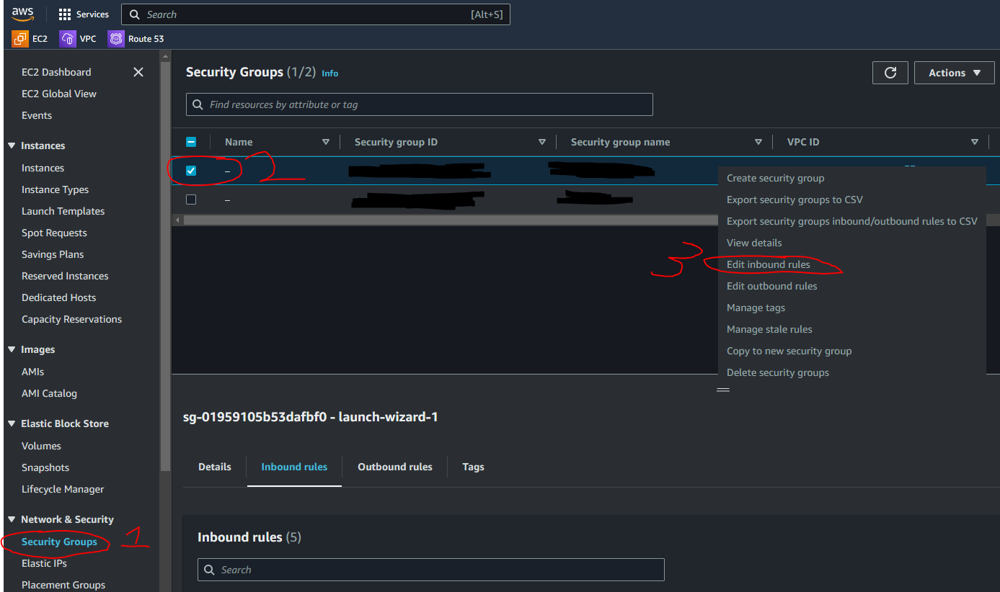

# Clone laradock

- 在 Winscp 下 ssh Server
- Clone laradock

  ```
  cd /home
  git clone https://github.com/Laradock/laradock.git
  cd Laradock
  cp .env.example .env

  # Start the server
  docker-compose up -d apache2 mysql phpmyadmin workspace

  # Verify success


  # Option
  # Rebuild and Start the server (If you changed the PHP version or other config in the env file)
  docker-compose up -d --build apache2 mysql phpmyadmin workspace

  # End the server
  docker-compose down

  # Enter the Workspace container
  docker-compose exec --user=laradock workspace bash

  ```

- Verify success
  ```
  docker ps
  ```
- test http://your_server_ip:port
- AWS console setting Inbound rules
  

# 參考資料

- https://home.gamer.com.tw/creationDetail.php?sn=5415251
- https://www.lidosblog.com/article/3
