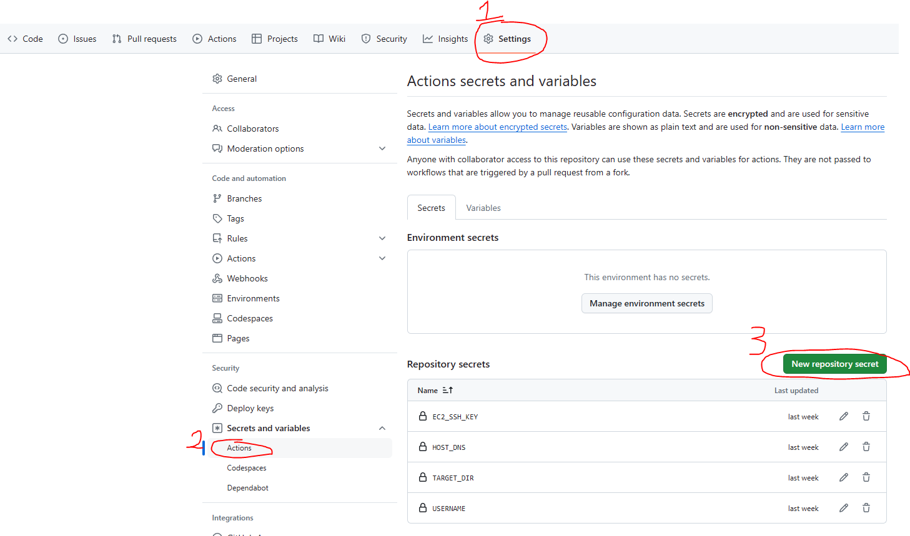
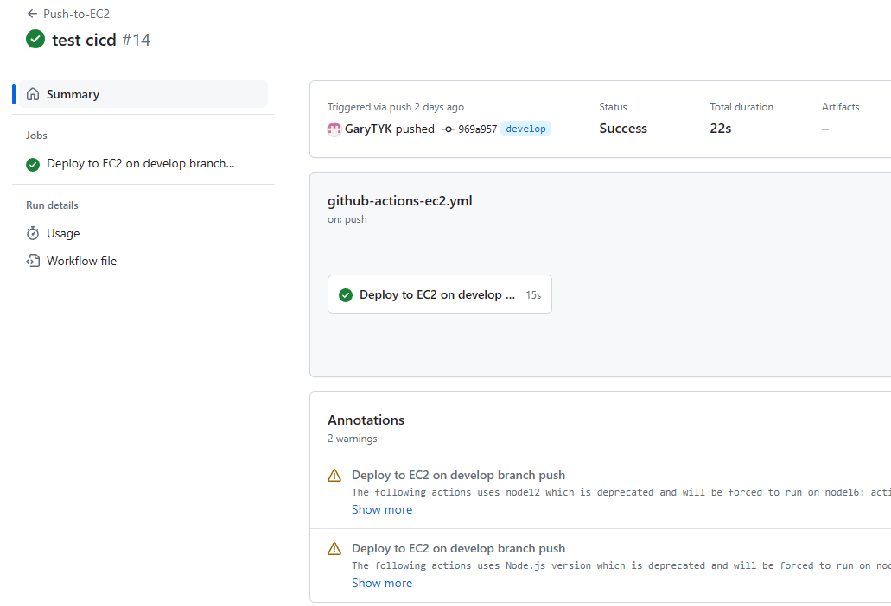

# AWS EC2 with a CI/CD Setup Using GitHub Actions

- Create a .github/workflows directory
- Creating workflow on .github/workflows/github-actions-ec2.yml

  ```
  name: Push-to-EC2

  # Trigger deployment only on push to main branch
  on:
    push:
      branches:
        - develop

  jobs:
    deploy:
      name: Deploy to EC2 on develop branch push
      runs-on: ubuntu-latest

      steps:
        - name: Checkout the files
          uses: actions/checkout@v2

        - name: Deploy to AWS Server
          uses: easingthemes/ssh-deploy@main
          env:
            SSH_PRIVATE_KEY: ${{ secrets.EC2_SSH_KEY }}
            REMOTE_HOST: ${{ secrets.HOST_DNS }}
            REMOTE_USER: ${{ secrets.USERNAME }}
            TARGET: ${{ secrets.TARGET_DIR }}

        - name: Executing remote ssh commands using ssh key
          uses: appleboy/ssh-action@master
          with:
            host: ${{ secrets.HOST_DNS }}
            username: ${{ secrets.USERNAME }}
            key: ${{ secrets.EC2_SSH_KEY }}
            script: |
              sudo apt-get -y update
              ls -al
              cd home
              ls -al
              sudo rm -rf /var/www/html/my-personal-portfolio/*
              sudo mv * /var/www/html/my-personal-portfolio

  ```

- add secrets in your github repository
  

1. EC2_SSH_KEY: This will be your .pem file which you will use to login to the instance

2. HOST_DNS: Public DNS record of the instance, it will look something like this ec2-xx-xxx-xxx-xxx.us-west-2.compute.amazonaws.com

3. USERNAME: Will be the username of the EC2 instance, usually ubuntu

4. TARGET_DIR: Is where you want to deploy your code.

- Done. Success cicd
  

# 參考資料

- https://www.youtube.com/watch?v=YBjrZZMXNe8&list=PLfSTZNQ-gVKY6C4VVgESPkulsXhIZ1uQW&index=4
- https://dev.to/yeshwanthlm/deploy-resume-to-aws-ec2-using-github-actions-4hog
